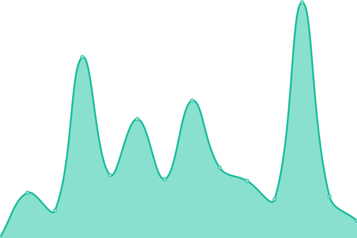
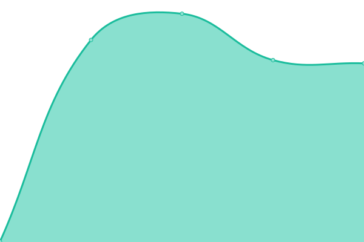
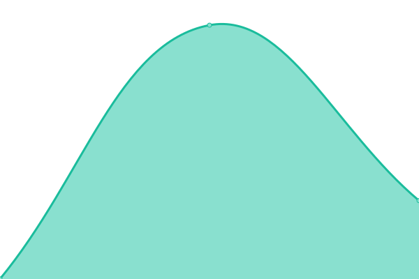

# [📈 Live Status](https://upptime.github.io/upptime): <!--live status--> **🟧 Partial outage**

This repository contains the open-source uptime monitor and status page for [Upptime](https://upptime.js.org), powered by [Upptime](https://github.com/upptime/upptime).

With [Upptime](https://upptime.js.org), you can get your own unlimited and free uptime monitor and status page, powered entirely by a GitHub repository. We use [Issues](https://github.com/upptime/upptime/issues) as incident reports, [Actions](https://github.com/adamus1red/ActivityPub-Relays/actions) as uptime monitors, and [Pages](https://upptime.github.io/upptime) for the status page.

<!--start: status pages-->
<!-- This summary is generated by Upptime (https://github.com/upptime/upptime) -->
<!-- Do not edit this manually, your changes will be overwritten -->
<!-- prettier-ignore -->
| URL | Status | History | Response Time | Uptime |
| --- | ------ | ------- | ------------- | ------ |
|  [en.relay.friendi.ca](https://en.relay.friendi.ca/actor) | 🟩 Up | [en-relay-friendi-ca.yml](https://github.com/adamus1red/ActivityPub-Relays/commits/HEAD/history/en-relay-friendi-ca.yml) | 

 4655ms
     
 | 

<a href="https://status.relays.national-defence.network/history/en-relay-friendi-ca">14.48%</a>
    

|  [federation.stream](https://federation.stream/actor) | 🟥 Down | [federation-stream.yml](https://github.com/adamus1red/ActivityPub-Relays/commits/HEAD/history/federation-stream.yml) | 

 0ms
     
 | 

<a href="https://status.relays.national-defence.network/history/federation-stream">0.00%</a>
    

|  [mastodon-relay.moew.science](https://mastodon-relay.moew.science/actor) | 🟩 Up | [mastodon-relay-moew-science.yml](https://github.com/adamus1red/ActivityPub-Relays/commits/HEAD/history/mastodon-relay-moew-science.yml) | 

 829ms
     
 | 

<a href="https://status.relays.national-defence.network/history/mastodon-relay-moew-science">100.00%</a>
    

|  [relay.101010.pl](https://relay.101010.pl/actor) | 🟩 Up | [relay-101010-pl.yml](https://github.com/adamus1red/ActivityPub-Relays/commits/HEAD/history/relay-101010-pl.yml) | 

 6445ms
     
 | 

<a href="https://status.relays.national-defence.network/history/relay-101010-pl">98.31%</a>
    

|  [relay.beckmeyer.us](https://relay.beckmeyer.us/actor) | 🟩 Up | [relay-beckmeyer-us.yml](https://github.com/adamus1red/ActivityPub-Relays/commits/HEAD/history/relay-beckmeyer-us.yml) | 

 290ms
     
 | 

<a href="https://status.relays.national-defence.network/history/relay-beckmeyer-us">100.00%</a>
    

|  [relay.c.im](https://relay.c.im/actor) | 🟥 Down | [relay-c-im.yml](https://github.com/adamus1red/ActivityPub-Relays/commits/HEAD/history/relay-c-im.yml) | 

 14861ms
     
 | 

<a href="https://status.relays.national-defence.network/history/relay-c-im">30.79%</a>
    

|  [relay.chocoflan.net](https://relay.chocoflan.net/actor) | 🟩 Up | [relay-chocoflan-net.yml](https://github.com/adamus1red/ActivityPub-Relays/commits/HEAD/history/relay-chocoflan-net.yml) | 

 195ms
     
 | 

<a href="https://status.relays.national-defence.network/history/relay-chocoflan-net">98.61%</a>
    

|  [relay.dresden.network](https://relay.dresden.network/actor) | 🟥 Down | [relay-dresden-network.yml](https://github.com/adamus1red/ActivityPub-Relays/commits/HEAD/history/relay-dresden-network.yml) | 

 790ms
     
 | 

<a href="https://status.relays.national-defence.network/history/relay-dresden-network">0.00%</a>
    

|  [relay.fedi.agency](https://relay.fedi.agency/actor) | 🟥 Down | [relay-fedi-agency.yml](https://github.com/adamus1red/ActivityPub-Relays/commits/HEAD/history/relay-fedi-agency.yml) | 

 8656ms
     
 | 

<a href="https://status.relays.national-defence.network/history/relay-fedi-agency">58.85%</a>
    

|  [relay.fedibird.com](https://relay.fedibird.com/actor) | 🟩 Up | [relay-fedibird-com.yml](https://github.com/adamus1red/ActivityPub-Relays/commits/HEAD/history/relay-fedibird-com.yml) | 

 1794ms
     
 | 

<a href="https://status.relays.national-defence.network/history/relay-fedibird-com">94.97%</a>
    

|  [relay.freespeech.club](https://relay.freespeech.club/actor) | 🟥 Down | [relay-freespeech-club.yml](https://github.com/adamus1red/ActivityPub-Relays/commits/HEAD/history/relay-freespeech-club.yml) | 

 158ms
     
 | 

<a href="https://status.relays.national-defence.network/history/relay-freespeech-club">0.00%</a>
    

|  [relay.froth.zone](https://relay.froth.zone/actor) | 🟩 Up | [relay-froth-zone.yml](https://github.com/adamus1red/ActivityPub-Relays/commits/HEAD/history/relay-froth-zone.yml) | 

 559ms
     
 | 

<a href="https://status.relays.national-defence.network/history/relay-froth-zone">100.00%</a>
    

|  [relay.glauca.space](https://relay.glauca.space/actor) | 🟩 Up | [relay-glauca-space.yml](https://github.com/adamus1red/ActivityPub-Relays/commits/HEAD/history/relay-glauca-space.yml) | 

 2259ms
     
 | 

<a href="https://status.relays.national-defence.network/history/relay-glauca-space">100.00%</a>
    

|  [relay.homunyan.com](https://relay.homunyan.com/actor) | 🟩 Up | [relay-homunyan-com.yml](https://github.com/adamus1red/ActivityPub-Relays/commits/HEAD/history/relay-homunyan-com.yml) | 

 2134ms
     
 | 

<a href="https://status.relays.national-defence.network/history/relay-homunyan-com">100.00%</a>
    

|  [relay.intahnet.co.uk](https://relay.intahnet.co.uk/actor) | 🟩 Up | [relay-intahnet-co-uk.yml](https://github.com/adamus1red/ActivityPub-Relays/commits/HEAD/history/relay-intahnet-co-uk.yml) | 

 359ms
     
 | 

<a href="https://status.relays.national-defence.network/history/relay-intahnet-co-uk">100.00%</a>
    

|  [relay.k3tan.com](https://relay.k3tan.com/actor) | 🟥 Down | [relay-k3tan-com.yml](https://github.com/adamus1red/ActivityPub-Relays/commits/HEAD/history/relay-k3tan-com.yml) | 

 106ms
     
 | 

<a href="https://status.relays.national-defence.network/history/relay-k3tan-com">0.00%</a>
    

|  [relay.libranet.de](https://relay.libranet.de/actor) | 🟩 Up | [relay-libranet-de.yml](https://github.com/adamus1red/ActivityPub-Relays/commits/HEAD/history/relay-libranet-de.yml) | 

 4926ms
     
 | 

<a href="https://status.relays.national-defence.network/history/relay-libranet-de">81.27%</a>
    

|  [relay.minecloud.ro](https://relay.minecloud.ro/actor) | 🟥 Down | [relay-minecloud-ro.yml](https://github.com/adamus1red/ActivityPub-Relays/commits/HEAD/history/relay-minecloud-ro.yml) | 

 19366ms
     
 | 

<a href="https://status.relays.national-defence.network/history/relay-minecloud-ro">28.20%</a>
    

|  [relay.mistli.net](https://relay.mistli.net/actor) | 🟩 Up | [relay-mistli-net.yml](https://github.com/adamus1red/ActivityPub-Relays/commits/HEAD/history/relay-mistli-net.yml) | 

 7799ms
     
 | 

<a href="https://status.relays.national-defence.network/history/relay-mistli-net">89.72%</a>
    

|  [relay.mstdn.live](https://relay.mstdn.live/actor) | 🟩 Up | [relay-mstdn-live.yml](https://github.com/adamus1red/ActivityPub-Relays/commits/HEAD/history/relay-mstdn-live.yml) | 

 231ms
     
 | 

<a href="https://status.relays.national-defence.network/history/relay-mstdn-live">94.01%</a>
    

|  [relay.pissdichal.de](https://relay.pissdichal.de/actor) | 🟥 Down | [relay-pissdichal-de.yml](https://github.com/adamus1red/ActivityPub-Relays/commits/HEAD/history/relay-pissdichal-de.yml) | 

 0ms
     
 | 

<a href="https://status.relays.national-defence.network/history/relay-pissdichal-de">0.00%</a>
    

|  [relay.retronerd.at](https://relay.retronerd.at/actor) | 🟥 Down | [relay-retronerd-at.yml](https://github.com/adamus1red/ActivityPub-Relays/commits/HEAD/history/relay-retronerd-at.yml) | 

 0ms
     
 | 

<a href="https://status.relays.national-defence.network/history/relay-retronerd-at">0.00%</a>
    

|  [relay.social.tigwali.fr](https://relay.social.tigwali.fr/actor) | 🟥 Down | [relay-social-tigwali-fr.yml](https://github.com/adamus1red/ActivityPub-Relays/commits/HEAD/history/relay-social-tigwali-fr.yml) | 

 534ms
     
 | 

<a href="https://status.relays.national-defence.network/history/relay-social-tigwali-fr">0.00%</a>
    

|  [relay.toot.yukimochi.jp](https://relay.toot.yukimochi.jp/actor) | 🟩 Up | [relay-toot-yukimochi-jp.yml](https://github.com/adamus1red/ActivityPub-Relays/commits/HEAD/history/relay-toot-yukimochi-jp.yml) | 

 517ms
     
 | 

<a href="https://status.relays.national-defence.network/history/relay-toot-yukimochi-jp">100.00%</a>
    

|  [relay.wagnersnetz.de](https://relay.wagnersnetz.de/actor) | 🟩 Up | [relay-wagnersnetz-de.yml](https://github.com/adamus1red/ActivityPub-Relays/commits/HEAD/history/relay-wagnersnetz-de.yml) | 

 508ms
     
 | 

<a href="https://status.relays.national-defence.network/history/relay-wagnersnetz-de">100.00%</a>
    

|  [relay.strizhakov.dev](https://relay.strizhakov.dev/actor) | 🟥 Down | [relay-strizhakov-dev.yml](https://github.com/adamus1red/ActivityPub-Relays/commits/HEAD/history/relay-strizhakov-dev.yml) | 

 0ms
     
 | 

<a href="https://status.relays.national-defence.network/history/relay-strizhakov-dev">0.00%</a>
    

|  [mastodon-relay.thedoodleproject.net](https://mastodon-relay.thedoodleproject.net/actor) | 🟥 Down | [mastodon-relay-thedoodleproject-net.yml](https://github.com/adamus1red/ActivityPub-Relays/commits/HEAD/history/mastodon-relay-thedoodleproject-net.yml) | 

 1098ms
     
 | 

<a href="https://status.relays.national-defence.network/history/mastodon-relay-thedoodleproject-net">20.54%</a>
    

|  [relay.masto.social](https://relay.masto.social/actor) | 🟩 Up | [relay-masto-social.yml](https://github.com/adamus1red/ActivityPub-Relays/commits/HEAD/history/relay-masto-social.yml) | 

 8138ms
     
 | 

<a href="https://status.relays.national-defence.network/history/relay-masto-social">98.17%</a>
    

|  [relay.wuff.space](https://relay.wuff.space/actor) | 🟥 Down | [relay-wuff-space.yml](https://github.com/adamus1red/ActivityPub-Relays/commits/HEAD/history/relay-wuff-space.yml) | 

 1556ms
     
 | 

<a href="https://status.relays.national-defence.network/history/relay-wuff-space">18.55%</a>
    

|  [relay.dog](https://relay.dog/actor) | 🟩 Up | [relay-dog.yml](https://github.com/adamus1red/ActivityPub-Relays/commits/HEAD/history/relay-dog.yml) | 

 409ms
     
 | 

<a href="https://status.relays.national-defence.network/history/relay-dog">100.00%</a>
    

|  [aprelay.thebackupbox.net](https://aprelay.thebackupbox.net/actor) | 🟥 Down | [aprelay-thebackupbox-net.yml](https://github.com/adamus1red/ActivityPub-Relays/commits/HEAD/history/aprelay-thebackupbox-net.yml) | 

 0ms
     
 | 

<a href="https://status.relays.national-defence.network/history/aprelay-thebackupbox-net">0.00%</a>
    

|  [relay.asonix.dog](https://relay.asonix.dog/actor) | 🟩 Up | [relay-asonix-dog.yml](https://github.com/adamus1red/ActivityPub-Relays/commits/HEAD/history/relay-asonix-dog.yml) | 

 606ms
     
 | 

<a href="https://status.relays.national-defence.network/history/relay-asonix-dog">100.00%</a>
    

|  [relay.chemnitz.social](https://relay.chemnitz.social/actor) | 🟥 Down | [relay-chemnitz-social.yml](https://github.com/adamus1red/ActivityPub-Relays/commits/HEAD/history/relay-chemnitz-social.yml) | 

 0ms
     
 | 

<a href="https://status.relays.national-defence.network/history/relay-chemnitz-social">0.00%</a>
    

|  [relay.darmstadt.social](https://relay.darmstadt.social/actor) | 🟩 Up | [relay-darmstadt-social.yml](https://github.com/adamus1red/ActivityPub-Relays/commits/HEAD/history/relay-darmstadt-social.yml) | 

 377ms
     
 | 

<a href="https://status.relays.national-defence.network/history/relay-darmstadt-social">100.00%</a>
    

|  [relay.fediverse.life](https://relay.fediverse.life/actor) | 🟥 Down | [relay-fediverse-life.yml](https://github.com/adamus1red/ActivityPub-Relays/commits/HEAD/history/relay-fediverse-life.yml) | 

 0ms
     
 | 

<a href="https://status.relays.national-defence.network/history/relay-fediverse-life">0.00%</a>
    

|  [relay.kretschmann.social](https://relay.kretschmann.social/actor) | 🟩 Up | [relay-kretschmann-social.yml](https://github.com/adamus1red/ActivityPub-Relays/commits/HEAD/history/relay-kretschmann-social.yml) | 

 1067ms
     
 | 

<a href="https://status.relays.national-defence.network/history/relay-kretschmann-social">100.00%</a>
    

|  [relay.mastodon.libresilicon.com](https://relay.mastodon.libresilicon.com/actor) | 🟥 Down | [relay-mastodon-libresilicon-com.yml](https://github.com/adamus1red/ActivityPub-Relays/commits/HEAD/history/relay-mastodon-libresilicon-com.yml) | 

 0ms
     
 | 

<a href="https://status.relays.national-defence.network/history/relay-mastodon-libresilicon-com">0.00%</a>
    

|  [relay.mastodon.scot](https://relay.mastodon.scot/actor) | 🟥 Down | [relay-mastodon-scot.yml](https://github.com/adamus1red/ActivityPub-Relays/commits/HEAD/history/relay-mastodon-scot.yml) | 

 0ms
     
 | 

<a href="https://status.relays.national-defence.network/history/relay-mastodon-scot">0.00%</a>
    

|  [relay.nfld.uk](https://relay.nfld.uk/actor) | 🟥 Down | [relay-nfld-uk.yml](https://github.com/adamus1red/ActivityPub-Relays/commits/HEAD/history/relay-nfld-uk.yml) | 

 395ms
     
 | 

<a href="https://status.relays.national-defence.network/history/relay-nfld-uk">0.00%</a>
    

|  [relay.nsupdate.info](https://relay.nsupdate.info/actor) | 🟥 Down | [relay-nsupdate-info.yml](https://github.com/adamus1red/ActivityPub-Relays/commits/HEAD/history/relay-nsupdate-info.yml) | 

 2977ms
     
 | 

<a href="https://status.relays.national-defence.network/history/relay-nsupdate-info">0.00%</a>
    

|  [relay.phreedom.club](https://relay.phreedom.club/actor) | 🟥 Down | [relay-phreedom-club.yml](https://github.com/adamus1red/ActivityPub-Relays/commits/HEAD/history/relay-phreedom-club.yml) | 

 0ms
     
 | 

<a href="https://status.relays.national-defence.network/history/relay-phreedom-club">0.00%</a>
    

|  [relay.social.firc.de](https://relay.social.firc.de/actor) | 🟥 Down | [relay-social-firc-de.yml](https://github.com/adamus1red/ActivityPub-Relays/commits/HEAD/history/relay-social-firc-de.yml) | 

 0ms
     
 | 

<a href="https://status.relays.national-defence.network/history/relay-social-firc-de">0.00%</a>
    

|  [relay2.mastodon.ml](https://relay2.mastodon.ml/actor) | 🟥 Down | [relay2-mastodon-ml.yml](https://github.com/adamus1red/ActivityPub-Relays/commits/HEAD/history/relay2-mastodon-ml.yml) | 

 1146ms
     
 | 

<a href="https://status.relays.national-defence.network/history/relay2-mastodon-ml">0.00%</a>
    

|  [relay.freespeech.club](https://relay.freespeech.club/actor) | 🟥 Down | [relay-freespeech-club.yml](https://github.com/adamus1red/ActivityPub-Relays/commits/HEAD/history/relay-freespeech-club.yml) | 

 158ms
     
 | 

<a href="https://status.relays.national-defence.network/history/relay-freespeech-club">0.00%</a>
    

<!--end: status pages-->

[**Visit our status website →**](https://upptime.github.io/upptime)

## 📄 License

- Powered by: [Upptime](https://github.com/upptime/upptime)
- Code: [MIT](./LICENSE) © [Upptime](https://upptime.js.org)
- Data in the `./history` directory: [Open Database License](https://opendatacommons.org/licenses/odbl/1-0/)
