# [📈 Live Status](https://status.relays.national-defence.network/): <!--live status--> **🟧 Partial outage**

This repository contains the open-source uptime monitor and status page for [Upptime](https://upptime.js.org), powered by [Upptime](https://github.com/upptime/upptime).

<!--start: status pages-->
<!-- This summary is generated by Upptime (https://github.com/upptime/upptime) -->
<!-- Do not edit this manually, your changes will be overwritten -->
<!-- prettier-ignore -->
| URL | Status | History | Response Time | Uptime |
| --- | ------ | ------- | ------------- | ------ |
|  [en.relay.friendi.ca](https://en.relay.friendi.ca/actor) | 🟩 Up | [en-relay-friendi-ca.yml](https://github.com/adamus1red/ActivityPub-Relays/commits/HEAD/history/en-relay-friendi-ca.yml) | 

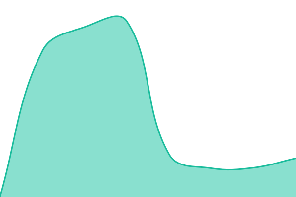 4532ms
     
 | 

<a href="https://status.relays.national-defence.network/history/en-relay-friendi-ca">100.00%</a>
    

|  [mastodon-relay.moew.science](https://mastodon-relay.moew.science/actor) | 🟩 Up | [mastodon-relay-moew-science.yml](https://github.com/adamus1red/ActivityPub-Relays/commits/HEAD/history/mastodon-relay-moew-science.yml) | 

 841ms
     
 | 

<a href="https://status.relays.national-defence.network/history/mastodon-relay-moew-science">100.00%</a>
    

|  [relay.101010.pl](https://relay.101010.pl/actor) | 🟩 Up | [relay-101010-pl.yml](https://github.com/adamus1red/ActivityPub-Relays/commits/HEAD/history/relay-101010-pl.yml) | 

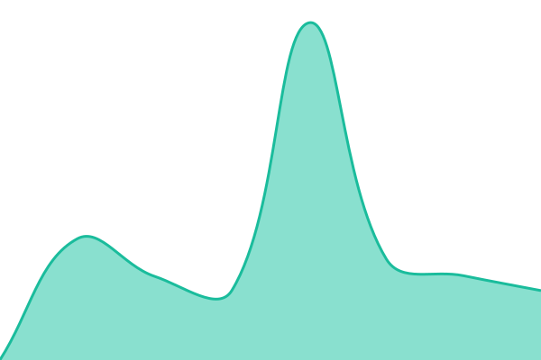 604ms
     
 | 

<a href="https://status.relays.national-defence.network/history/relay-101010-pl">100.00%</a>
    

|  [relay.c.im](https://relay.c.im/actor) | 🟩 Up | [relay-c-im.yml](https://github.com/adamus1red/ActivityPub-Relays/commits/HEAD/history/relay-c-im.yml) | 

 535ms
     
 | 

<a href="https://status.relays.national-defence.network/history/relay-c-im">100.00%</a>
    

|  [relay.chocoflan.net](https://relay.chocoflan.net/actor) | 🟥 Down | [relay-chocoflan-net.yml](https://github.com/adamus1red/ActivityPub-Relays/commits/HEAD/history/relay-chocoflan-net.yml) | 

 168ms
     
 | 

<a href="https://status.relays.national-defence.network/history/relay-chocoflan-net">0.00%</a>
    

|  [relay.dresden.network](https://relay.dresden.network/actor) | 🟩 Up | [relay-dresden-network.yml](https://github.com/adamus1red/ActivityPub-Relays/commits/HEAD/history/relay-dresden-network.yml) | 

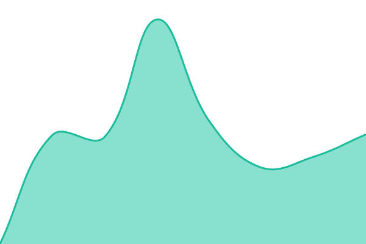 788ms
     
 | 

<a href="https://status.relays.national-defence.network/history/relay-dresden-network">100.00%</a>
    

|  [relay.fedi.agency](https://relay.fedi.agency/actor) | 🟩 Up | [relay-fedi-agency.yml](https://github.com/adamus1red/ActivityPub-Relays/commits/HEAD/history/relay-fedi-agency.yml) | 

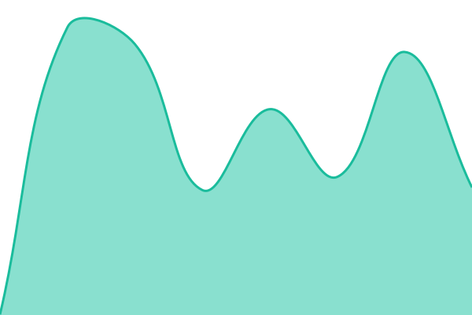 227ms
     
 | 

<a href="https://status.relays.national-defence.network/history/relay-fedi-agency">100.00%</a>
    

|  [relay.fedibird.com](https://relay.fedibird.com/actor) | 🟩 Up | [relay-fedibird-com.yml](https://github.com/adamus1red/ActivityPub-Relays/commits/HEAD/history/relay-fedibird-com.yml) | 

 467ms
     
 | 

<a href="https://status.relays.national-defence.network/history/relay-fedibird-com">100.00%</a>
    

|  [relay.froth.zone](https://relay.froth.zone/actor) | 🟩 Up | [relay-froth-zone.yml](https://github.com/adamus1red/ActivityPub-Relays/commits/HEAD/history/relay-froth-zone.yml) | 

 1839ms
     
 | 

<a href="https://status.relays.national-defence.network/history/relay-froth-zone">100.00%</a>
    

|  [relay.glauca.space](https://relay.glauca.space/actor) | 🟩 Up | [relay-glauca-space.yml](https://github.com/adamus1red/ActivityPub-Relays/commits/HEAD/history/relay-glauca-space.yml) | 

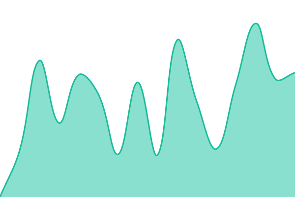 889ms
     
 | 

<a href="https://status.relays.national-defence.network/history/relay-glauca-space">97.29%</a>
    

|  [relay.homunyan.com](https://relay.homunyan.com/actor) | 🟥 Down | [relay-homunyan-com.yml](https://github.com/adamus1red/ActivityPub-Relays/commits/HEAD/history/relay-homunyan-com.yml) | 

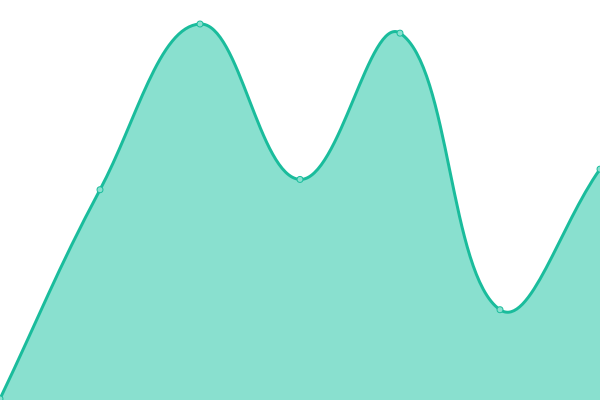 0ms
     
 | 

<a href="https://status.relays.national-defence.network/history/relay-homunyan-com">0.00%</a>
    

|  [relay.intahnet.co.uk](https://relay.intahnet.co.uk/actor) | 🟩 Up | [relay-intahnet-co-uk.yml](https://github.com/adamus1red/ActivityPub-Relays/commits/HEAD/history/relay-intahnet-co-uk.yml) | 

 219ms
     
 | 

<a href="https://status.relays.national-defence.network/history/relay-intahnet-co-uk">85.64%</a>
    

|  [relay.k3tan.com](https://relay.k3tan.com/actor) | 🟥 Down | [relay-k3tan-com.yml](https://github.com/adamus1red/ActivityPub-Relays/commits/HEAD/history/relay-k3tan-com.yml) | 

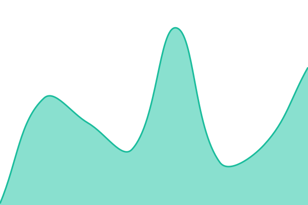 32ms
     
 | 

<a href="https://status.relays.national-defence.network/history/relay-k3tan-com">100.00%</a>
    

|  [relay.libranet.de](https://relay.libranet.de/actor) | 🟥 Down | [relay-libranet-de.yml](https://github.com/adamus1red/ActivityPub-Relays/commits/HEAD/history/relay-libranet-de.yml) | 

 0ms
     
 | 

<a href="https://status.relays.national-defence.network/history/relay-libranet-de">0.00%</a>
    

|  [relay.minecloud.ro](https://relay.minecloud.ro/actor) | 🟩 Up | [relay-minecloud-ro.yml](https://github.com/adamus1red/ActivityPub-Relays/commits/HEAD/history/relay-minecloud-ro.yml) | 

 1200ms
     
 | 

<a href="https://status.relays.national-defence.network/history/relay-minecloud-ro">99.17%</a>
    

|  [relay.mistli.net](https://relay.mistli.net/actor) | 🟥 Down | [relay-mistli-net.yml](https://github.com/adamus1red/ActivityPub-Relays/commits/HEAD/history/relay-mistli-net.yml) | 

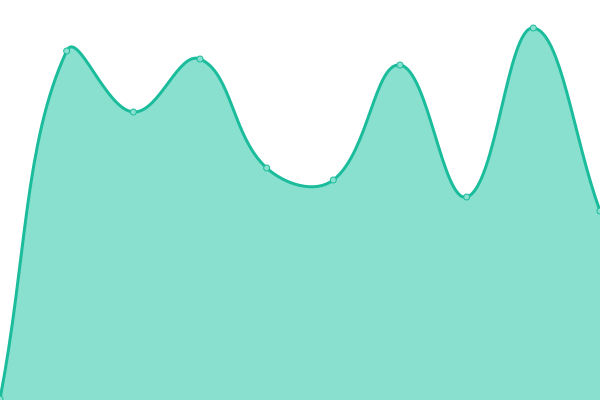 0ms
     
 | 

<a href="https://status.relays.national-defence.network/history/relay-mistli-net">0.00%</a>
    

|  [relay.mstdn.live](https://relay.mstdn.live/actor) | 🟥 Down | [relay-mstdn-live.yml](https://github.com/adamus1red/ActivityPub-Relays/commits/HEAD/history/relay-mstdn-live.yml) | 

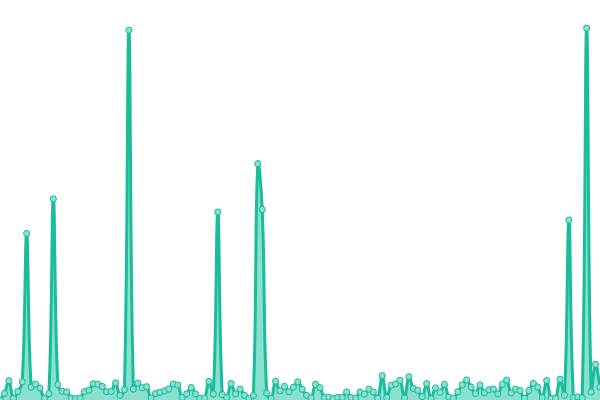 0ms
     
 | 

<a href="https://status.relays.national-defence.network/history/relay-mstdn-live">0.00%</a>
    

|  [relay.pissdichal.de](https://relay.pissdichal.de/actor) | 🟩 Up | [relay-pissdichal-de.yml](https://github.com/adamus1red/ActivityPub-Relays/commits/HEAD/history/relay-pissdichal-de.yml) | 

 495ms
     
 | 

<a href="https://status.relays.national-defence.network/history/relay-pissdichal-de">100.00%</a>
    

|  [relay.toot.yukimochi.jp](https://relay.toot.yukimochi.jp/actor) | 🟩 Up | [relay-toot-yukimochi-jp.yml](https://github.com/adamus1red/ActivityPub-Relays/commits/HEAD/history/relay-toot-yukimochi-jp.yml) | 

 540ms
     
 | 

<a href="https://status.relays.national-defence.network/history/relay-toot-yukimochi-jp">100.00%</a>
    

|  [relay.wagnersnetz.de](https://relay.wagnersnetz.de/actor) | 🟩 Up | [relay-wagnersnetz-de.yml](https://github.com/adamus1red/ActivityPub-Relays/commits/HEAD/history/relay-wagnersnetz-de.yml) | 

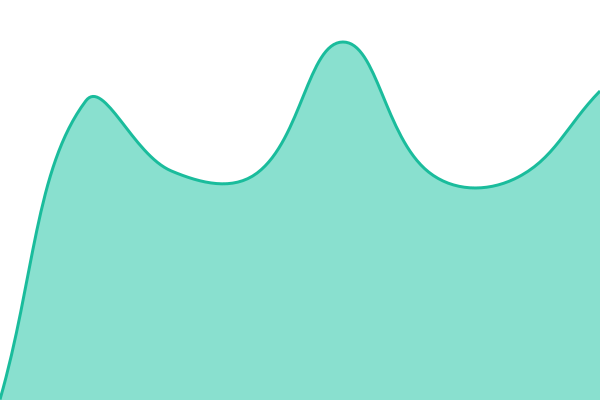 581ms
     
 | 

<a href="https://status.relays.national-defence.network/history/relay-wagnersnetz-de">100.00%</a>
    

|  [mastodon-relay.thedoodleproject.net](https://mastodon-relay.thedoodleproject.net/actor) | 🟩 Up | [mastodon-relay-thedoodleproject-net.yml](https://github.com/adamus1red/ActivityPub-Relays/commits/HEAD/history/mastodon-relay-thedoodleproject-net.yml) | 

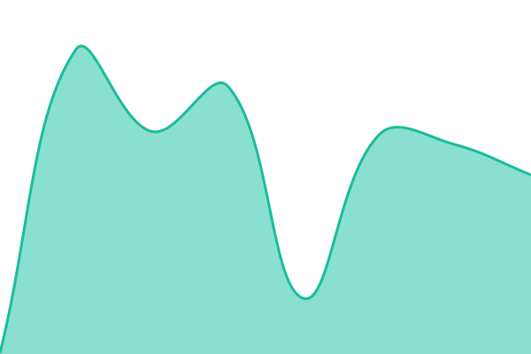 161ms
     
 | 

<a href="https://status.relays.national-defence.network/history/mastodon-relay-thedoodleproject-net">96.19%</a>
    

|  [relay.masto.social](https://relay.masto.social/actor) | 🟥 Down | [relay-masto-social.yml](https://github.com/adamus1red/ActivityPub-Relays/commits/HEAD/history/relay-masto-social.yml) | 

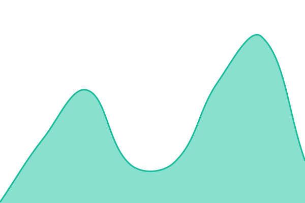 85ms
     
 | 

<a href="https://status.relays.national-defence.network/history/relay-masto-social">0.00%</a>
    

|  [relay.wuff.space](https://relay.wuff.space/actor) | 🟥 Down | [relay-wuff-space.yml](https://github.com/adamus1red/ActivityPub-Relays/commits/HEAD/history/relay-wuff-space.yml) | 

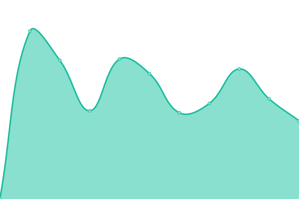 0ms
     
 | 

<a href="https://status.relays.national-defence.network/history/relay-wuff-space">0.00%</a>
    

|  [relay.dog](https://relay.dog/actor) | 🟩 Up | [relay-dog.yml](https://github.com/adamus1red/ActivityPub-Relays/commits/HEAD/history/relay-dog.yml) | 

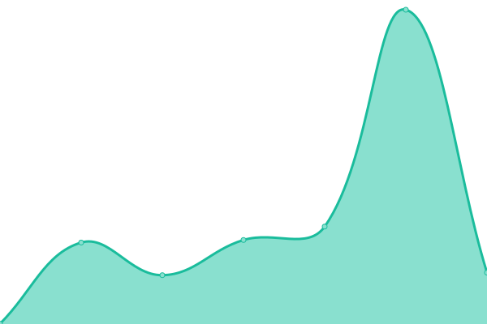 343ms
     
 | 

<a href="https://status.relays.national-defence.network/history/relay-dog">98.46%</a>
    

|  [relay.asonix.dog](https://relay.asonix.dog/actor) | 🟩 Up | [relay-asonix-dog.yml](https://github.com/adamus1red/ActivityPub-Relays/commits/HEAD/history/relay-asonix-dog.yml) | 

 423ms
     
 | 

<a href="https://status.relays.national-defence.network/history/relay-asonix-dog">100.00%</a>
    

|  [relay.darmstadt.social](https://relay.darmstadt.social/actor) | 🟩 Up | [relay-darmstadt-social.yml](https://github.com/adamus1red/ActivityPub-Relays/commits/HEAD/history/relay-darmstadt-social.yml) | 

 680ms
     
 | 

<a href="https://status.relays.national-defence.network/history/relay-darmstadt-social">100.00%</a>
    

|  [relay.kretschmann.social](https://relay.kretschmann.social/actor) | 🟥 Down | [relay-kretschmann-social.yml](https://github.com/adamus1red/ActivityPub-Relays/commits/HEAD/history/relay-kretschmann-social.yml) | 

 397ms
     
 | 

<a href="https://status.relays.national-defence.network/history/relay-kretschmann-social">0.00%</a>
    

<!--end: status pages-->

## 📄 License

- Powered by: [Upptime](https://github.com/upptime/upptime)
- Code: [MIT](./LICENSE) © [Upptime](https://upptime.js.org)
- Data in the `./history` directory: [Open Database License](https://opendatacommons.org/licenses/odbl/1-0/)
